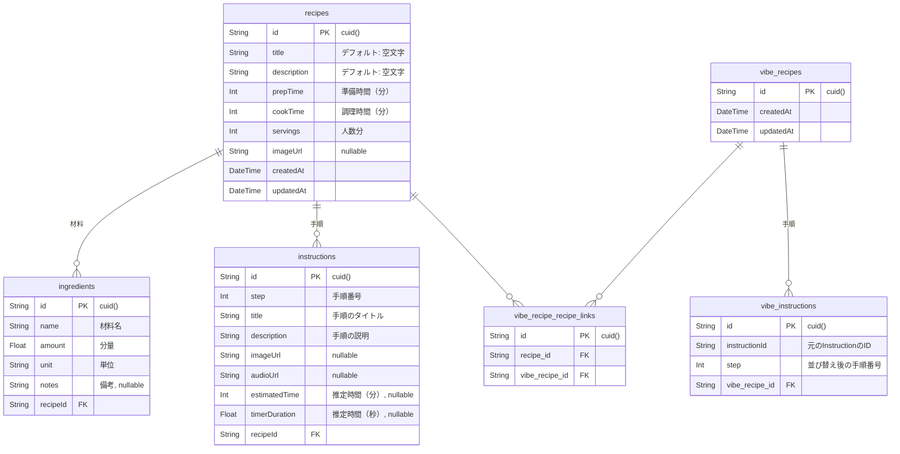

# ER 図

```mermaid
erDiagram
    recipes {
        String id PK "cuid()"
        String title "デフォルト: 空文字"
        String description "デフォルト: 空文字"
        Int prepTime "準備時間（分）"
        Int cookTime "調理時間（分）"
        Int servings "人数分"
        String imageUrl "nullable"
        DateTime createdAt
        DateTime updatedAt
    }

    ingredients {
        String id PK "cuid()"
        String name "材料名"
        Float amount "分量"
        String unit "単位"
        String notes "備考, nullable"
        String recipeId FK
    }

    instructions {
        String id PK "cuid()"
        Int step "手順番号"
        String title "手順のタイトル"
        String description "手順の説明"
        String imageUrl "nullable"
        String audioUrl "nullable"
        Int estimatedTime "推定時間（分）, nullable"
        Float timerDuration "推定時間（秒）, nullable"
        String recipeId FK
    }


    vibe_recipes {
        String id PK "cuid()"
        DateTime createdAt
        DateTime updatedAt
    }

    vibe_recipe_recipe_links {
        String id PK "cuid()"
        String recipe_id FK
        String vibe_recipe_id FK
    }

    vibe_instructions {
        String id PK "cuid()"
        String instructionId "元のInstructionのID"
        Int step "並び替え後の手順番号"
        String vibe_recipe_id FK
    }

    recipes ||--o{ ingredients : "材料"
    recipes ||--o{ instructions : "手順"
    recipes ||--o{ vibe_recipe_recipe_links : ""
    vibe_recipes ||--o{ vibe_recipe_recipe_links : ""
    vibe_recipes ||--o{ vibe_instructions : "手順"
```
